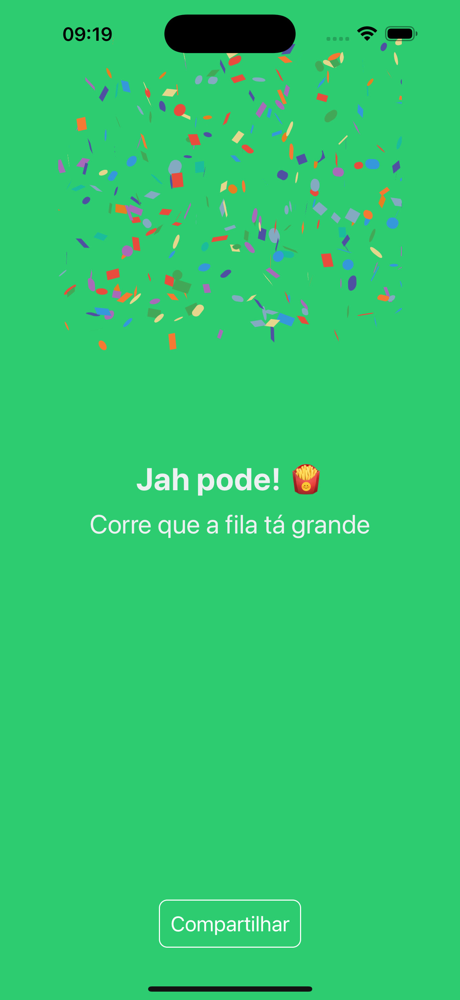
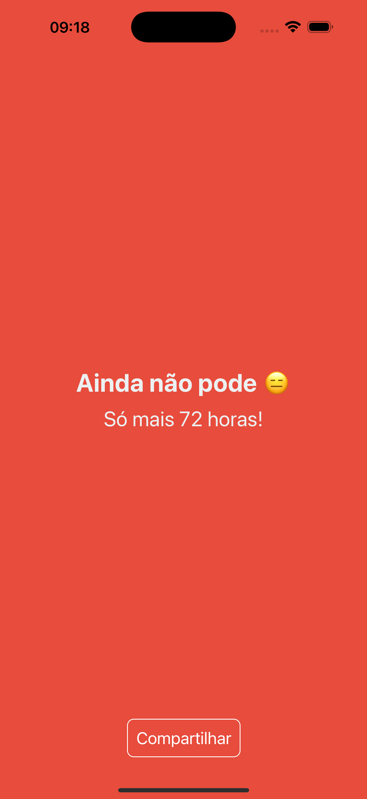

# Jah Pod Allmossar

Jah Pod All Mosssar is a lighthearted mobile application designed to answer one of life’s most relatable questions: “Is it lunchtime yet?” With a playful approach, the app provides users with humorous and engaging messages to inform them if it’s time for lunch or if they need to wait a bit longer.

## Screenshots




## Table of Contents

- [Introduction](#introduction)
- [Features](#features)
- [Installation](#installation)
- [Usage](#usage)
- [Contributing](#contributing)
- [License](#license)

## Introduction

Jah Pod Allmossar is a mobile application built using Expo. It aims to provide a seamless user experience with a variety of features.

## Features

- User authentication
- Real-time updates
- Push notifications
- Offline support

## Installation

To get started with the project, follow these steps:

1. Clone the repository:
   ```sh
   git clone https://github.com/yourusername/jah-pod-allmossar.git
   ```
2. Navigate to the project directory:
   ```sh
   cd jah-pod-allmossar
   ```
3. Install the dependencies:
   ```sh
   npm install
   ```
4. Start the Expo server:
   ```sh
   npm start
   ```

## Usage

To run the application on your device or emulator, use the Expo Go app or an Android/iOS emulator.

## Contributing

We welcome contributions! Please read our [contributing guidelines](CONTRIBUTING.md) for more details.

## License

This project is licensed under the MIT License. See the [LICENSE](LICENSE) file for more information.